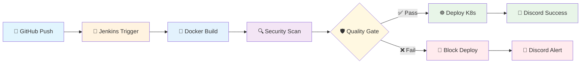
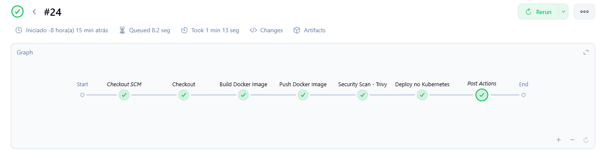
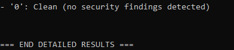
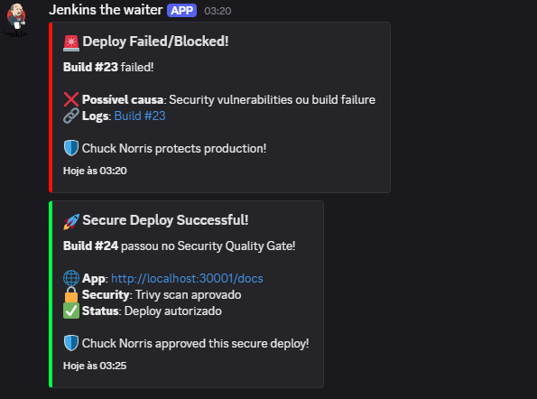
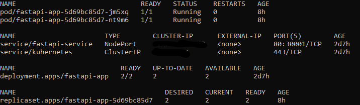

# 🚀 Pipeline DevSecOps - FastAPI + Jenkins + Kubernetes

<div align="center">

[](http://localhost:8080/job/fastapi-jenkins-pipeline/)
[](docs/SECURITY.md)
[](https://hub.docker.com/r/jamalshadowdev/fastapi-jenkins)
[](LICENSE)

</div>

<div align="center">

### 🛠️ **Stack Tecnológica Principal**


### 🔒 **DevSecOps & Monitoramento**


</div>

---

> **Pipeline CI/CD completa com integração de segurança automatizada**  
> Desenvolvido como parte do programa de estágio DevSecOps na **CompassUOL**

## 📋 Sobre o Projeto

Pipeline CI/CD enterprise-grade que implementa **práticas DevSecOps** com automação total desde o código até produção. Inclui scanner de vulnerabilidades integrado, quality gates de segurança rigorosos e sistema de notificações automáticas.

### 🎯 Objetivos Alcançados
- ✅ **Pipeline CI/CD** totalmente automatizada com Jenkins
- ✅ **Containerização** segura com Docker Alpine  
- ✅ **Deploy automático** no Kubernetes com health checks
- ✅ **Security scanning** com Trivy e quality gates rigorosos
- ✅ **Zero vulnerabilidades** em produção
- ✅ **Notificações automáticas** via Discord webhooks
- ✅ **Logs de segurança** detalhados e auditáveis

---

## 🏗️ Arquitetura da Pipeline

<div align="center">



</div>

### 🔄 **Fluxo Automático**
```
GitHub Push → Jenkins → Docker Build → Trivy Scan → Quality Gate → Kubernetes Deploy → Discord Notification
```

---

## 🏗️ Status do Projeto

### ✅ **Fase 1: Preparação do Projeto (CONCLUÍDA)**
- [x] Repositório GitHub criado e configurado
- [x] Código FastAPI funcionando localmente
- [x] Python 3.11 e dependências configuradas  
- [x] Branches `main` (produção) e `dev` (desenvolvimento) criadas
- [x] Todos os 6 endpoints testados e funcionais
- [x] **[📖 Guia Detalhado](docs/fase1-preparacao.md)**

### ✅ **Fase 2: Containerização com Docker (CONCLUÍDA)**
- [x] Dockerfile Alpine otimizado com usuário não-root
- [x] Build da imagem Docker local funcionando
- [x] Push automático para Docker Hub (`jamalshadowdev/fastapi-jenkins`)
- [x] Testes de container validados
- [x] Health checks implementados e funcionando
- [x] **[🐳 Guia Detalhado](docs/fase2-docker.md)**

### ✅ **Fase 3: Deploy no Kubernetes (CONCLUÍDA)**
- [x] Manifests de Deployment criados (2 réplicas + rolling updates)
- [x] Service do Kubernetes configurado (NodePort 30001)
- [x] Aplicação exposta via NodePort funcionando
- [x] Testes no cluster local (Kind) aprovados
- [x] Health checks automáticos validados
- [x] **[☸️ Guia Detalhado](docs/fase3-kubernetes.md)**

### ✅ **Fase 4: Pipeline Jenkins - Build & Push (CONCLUÍDA)**
- [x] Pipeline Jenkins configurada e funcionando
- [x] Stage de build Docker implementado
- [x] Stage de push para Docker Hub automático
- [x] Versionamento automático com BUILD_ID
- [x] Webhook GitHub → Jenkins funcionando
- [x] **[🔧 Guia Detalhado](docs/fase4-jenkins-pipeline.md)**

### ✅ **Fase 5: Pipeline Jenkins - Deploy (CONCLUÍDA)**
- [x] Jenkins com acesso ao kubectl configurado
- [x] Stage de deploy no Kubernetes implementado
- [x] Pipeline completa funcionando automaticamente
- [x] Deploy automatizado em produção
- [x] Rolling updates sem downtime
- [x] **[🚀 Guia Detalhado](docs/fase5-jenkins-deploy.md)**

### ✅ **Fase 6: Documentação & Extras DevSecOps (CONCLUÍDA)**
- [x] README atualizado com status detalhado
- [x] Screenshots da pipeline funcionando
- [x] Webhook GitHub + ngrok configurado
- [x] Documentação de reprodução completa
- [x] **Trivy security scanner** integrado
- [x] **Discord webhooks** para notificações
- [x] **Zero vulnerabilidades** através de Alpine
- [x] **Quality gates** de segurança rigorosos
- [x] **[📚 Guia Detalhado](docs/fase6-documentacao.md)**

### 🎯 **Extras DevSecOps Implementados**
- 🔍 **Trivy Security Scanner** com quality gates automáticos
- 🤖 **Discord Webhooks** para notificações em tempo real
- 📊 **Security Logs** com histórico completo e auditoria
- 🏔️ **Alpine Migration** resultando em zero vulnerabilidades

---

## 🚀 Quick Start

<div align="center">

### 📱 **Aplicação em Produção**
**[🌐 Swagger UI - http://localhost:30001/docs](http://localhost:30001/docs)**

</div>

```bash
# 🔥 Teste rápido da aplicação
curl http://localhost:30001/time
curl http://localhost:30001/color

# 🐳 Executar localmente
docker run -p 8000:8000 jamalshadowdev/fastapi-jenkins:latest

# 💻 Desenvolvimento local
git clone https://github.com/JamalShadowDev/projeto-fastapi-jenkins.git
cd projeto-fastapi-jenkins/backend
pip install -r requirements.txt
uvicorn main:app --reload
```

---

## 📚 Guias de Reprodução por Etapa

### 📋 **Guias Detalhados por Fase**

- **[📝 Fase 1 - Preparação](docs/fase1-preparacao.md)**: Setup inicial, repositório e API local
- **[🐳 Fase 2 - Docker](docs/fase2-docker.md)**: Containerização e Docker Hub
- **[☸️ Fase 3 - Kubernetes](docs/fase3-kubernetes.md)**: Deploy no Kind e configuração K8s  
- **[🔧 Fase 4 - Jenkins Pipeline](docs/fase4-jenkins-pipeline.md)**: Build e Push automatizados
- **[🚀 Fase 5 - Deploy](docs/fase5-jenkins-deploy.md)**: Deploy automático e webhooks
- **[📚 Fase 6 - Documentação](docs/fase6-documentacao.md)**: Docs e validação final

---

## 🔒 Security & Quality

<div align="center">

### 📊 **Métricas de Segurança**

| Métrica | Valor Atual | Status |
|---------|-------------|--------|
| **Vulnerabilidades** | 0 CRITICAL/HIGH | 🟢 |
| **Base Image** | Alpine Linux | 🟢 |
| **Container Security** | Non-root (UID 1000) | 🟢 |
| **Quality Gate** | CRITICAL/HIGH = Block | 🟢 |

</div>

### 🛡️ **Evolução de Segurança**

```bash
📊 Debian (Build 18): 6 vulnerabilities (1 CRITICAL, 5 HIGH) ❌
📊 Debian (Build 19): 4 vulnerabilities (1 CRITICAL, 3 HIGH) ⚠️  
📊 Alpine (Build 21): 0 vulnerabilities (CLEAN!) ✅
```

### 🔍 **Pipeline de Segurança**
1. **Trivy Scan** automático após cada build
2. **Quality Gate** com bloqueio para vulnerabilidades críticas
3. **Deploy liberado** apenas após aprovação de segurança
4. **Logs detalhados** para auditoria e compliance

---

## 📸 Pipeline em Funcionamento

<div align="center">

### 🎯 **Jenkins Pipeline Completa**


### 🔍 **Security Scan - Zero Vulnerabilidades**  


### 🤖 **Discord Notifications**


### ☸️ **Kubernetes Deployment**


</div>

---

## 🔗 Links Importantes

<div align="center">

| Recurso | Link | Descrição |
|---------|------|-----------|
| 🌐 **Aplicação Live** | [localhost:30001/docs](http://localhost:30001/docs) | Swagger UI funcionando |
| 🐳 **Docker Hub** | [jamalshadowdev/fastapi-jenkins](https://hub.docker.com/r/jamalshadowdev/fastapi-jenkins) | Registry de imagens |
| 🔧 **Jenkins Pipeline** | [localhost:8080](http://localhost:8080) | Dashboard Jenkins |

</div>

---

## 📈 Evolução do Projeto

<details>
<summary><strong>🔧 Histórico de Builds e Melhorias</strong></summary>

### **Builds 17-20: Desenvolvimento e Debugging**
- **Build 17**: Baseline pré-Trivy
- **Build 18**: Implementação inicial Trivy (debugging instalação)
- **Build 19**: Trivy funcionando (Debian com vulnerabilidades)
- **Build 20**: Correções e ajustes diversos

### **Builds 21-24: Produção e Validação**
- **Build 21**: ✅ Alpine + zero vulnerabilidades + deploy sucesso
- **Build 22**: ✅ Discord webhooks funcionando
- **Build 23**: ❌ Teste controlado de erro (validação)
- **Build 24**: ✅ Pipeline final operacional

</details>

---

## 👥 Créditos

<div align="center">

### 📚 **Código Base da API**
Fornecido pelos instrutores da **CompassUOL**  
Programa de Estágio DevSecOps

### 🚀 **Implementação DevSecOps**
**Marcos Moreira (Jamal)**  
*Estagiário DevSecOps na CompassUOL*

**Especializações implementadas:**
- 🛡️ Pipeline CI/CD com security-first approach
- 🔍 Integração Trivy para vulnerability scanning  
- 🏔️ Migração Alpine para zero vulnerabilities
- 🤖 Automação completa GitHub → Kubernetes
- 📊 Sistema de notificações e monitoramento

</div>

---

## 📄 Licença

Este projeto está licenciado sob a **[MIT License](LICENSE)**.

---

<div align="center">

**🛡️ ZERO VULNERABILITIES | 🚀 100% AUTOMATED | 💪 CHUCK NORRIS APPROVED**

*Pipeline DevSecOps enterprise-grade funcionando em produção*

[](https://compass.uol.com.br/)

</div>