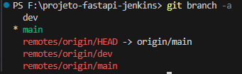
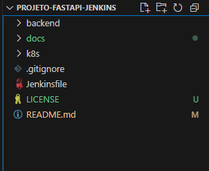
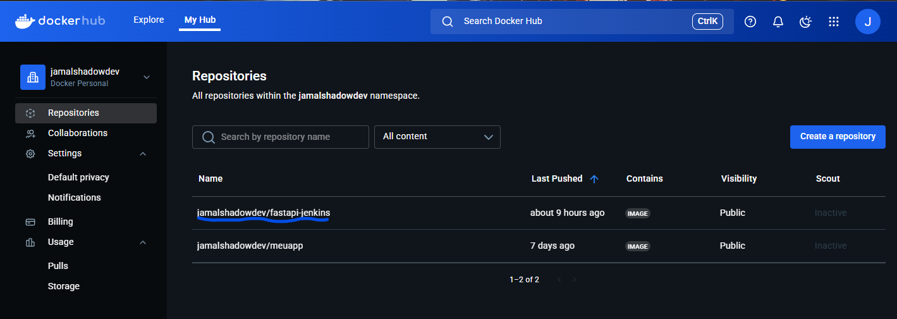
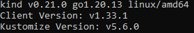

# Fase 1: Preparação do Projeto

Este documento descreve a configuração inicial do ambiente para a aplicação FastAPI que será deployada através de pipeline CI/CD com Jenkins e Kubernetes.

## 📋 Visão Geral

Esta fase estabelece a base para o desenvolvimento, incluindo:
- Configuração do repositório GitHub com branches de desenvolvimento
- Preparação da conta Docker Hub para registry de imagens
- Validação da aplicação FastAPI rodando localmente
- Verificação do ambiente Docker e Kubernetes

## 🎯 Objetivos

- [x] Criar repositório no GitHub com estrutura adequada
- [x] Configurar branches `main` (produção) e `dev` (desenvolvimento)
- [x] Configurar conta no Docker Hub
- [x] Validar execução local da aplicação FastAPI
- [x] Verificar ambiente Docker e Kubernetes (Kind)

## 🛠️ Pré-requisitos

### Software Necessário
- **Python** 3.9+ (para teste local básico)
- **Git** 2.30+
- **Docker** (será usado na Fase 2)
- **Kind** ou **Minikube** (Kubernetes local)
- **VS Code** (opcional)

### Sistema Operacional
- ✅ **Windows 10/11 com WSL2** (método utilizado neste guia)

### Contas Necessárias
- Conta no [GitHub](https://github.com)
- Conta no [Docker Hub](https://hub.docker.com)

## 🚀 Configuração do Ambiente

### 1. Repositório GitHub

#### 1.1 Criar Repositório
Crie um novo repositório seguindo a [documentação oficial](https://docs.github.com/pt/repositories/creating-and-managing-repositories/creating-a-new-repository).

**Repositório do projeto:** `projeto-fastapi-jenkins`

#### 1.2 Clone e Configuração de Branches
```bash
# Clone do repositório
git clone https://github.com/SEU_USUARIO/projeto-fastapi-jenkins.git
cd projeto-fastapi-jenkins

# Criar branch de desenvolvimento
git checkout -b dev

# Verificar branches
git branch -a
```



#### 1.3 Estrutura do Projeto
```bash
# Criar estrutura de diretórios
mkdir -p backend docs k8s

# Estrutura esperada:
projeto-fastapi-jenkins/
├── backend/          # Código da API FastAPI
├── docs/            # Documentação detalhada  
├── k8s/             # Manifests Kubernetes
├── README.md        # Documentação principal
└── .gitignore       # Arquivos ignorados
```



### 2. Docker Hub

Crie sua conta seguindo o [guia oficial](https://docs.docker.com/accounts/create-account/).

**Validação da conta:**
```bash
docker login
# Username: seu_usuario_dockerhub
# Password: sua_senha
```



### 3. Kubernetes Local (Kind)

**Validação da instalação:**
```bash
# Verificar Kind
kind version

# Verificar kubectl
kubectl version --client

# Verificar cluster (se já existir)
kubectl get nodes
```



## 💻 Configuração da Aplicação FastAPI

### 1. Código Base da API

#### 1.1 Arquivo Principal
**Arquivo:** `backend/main.py`

💡 **Código fornecido pelos instrutores CompassUOL** - Use o arquivo disponibilizado no projeto base.

**Estrutura da API** (6 endpoints):
```python
from fastapi import FastAPI
# ... configurações

@app.get("/color")      # Cor hexadecimal aleatória
@app.get("/cat")        # Imagem de gato via API externa
@app.get("/random-photo") # Foto aleatória (Picsum)
@app.get("/time")       # Timestamp atual
@app.get("/scare")      # GIF de susto
@app.get("/lookalike")  # Avatar aleatório
```

#### 1.2 Dependências
**Arquivo:** `backend/requirements.txt`
```txt
fastapi==0.104.1
uvicorn==0.24.0
httpx==0.25.2
pydantic==2.5.0
```

#### 1.3 Gitignore
**Arquivo:** `.gitignore`
```gitignore
# Python essentials
__pycache__/
*.py[cod]
.Python
venv/
.env

# Docker & IDE
.docker/
.vscode/settings.json
.idea/

# OS & Logs  
.DS_Store
*.log
```

### 2. Teste Local (Opcional)

#### 2.1 Instalação Rápida
```bash
# Navegar para backend
cd backend

# Instalar dependências (método simples)
pip install fastapi uvicorn httpx
```

#### 2.2 Execução da API
```bash
# Executar aplicação
uvicorn main:app --reload
```

**Resultado esperado:**
```
INFO:     Uvicorn running on http://127.0.0.1:8000 (Press CTRL+C to quit)
INFO:     Started reloader process [xxxxx] using StatReload
```

#### 2.3 Teste da API
Acesse a documentação interativa: **http://127.0.0.1:8000/docs**

#### 2.4 Validação dos Endpoints

Teste pelo menos 2-3 endpoints através da interface Swagger:

```bash
# Teste via curl (alternativo)
curl http://127.0.0.1:8000/time
# Retorno: {"current_time": "2025-06-13 14:30:45"}
```

✅ **Status esperado:** Todos os endpoints testados devem retornar **200 OK**

### 3. Commit das Alterações

```bash
# Adicionar arquivos
git add .

# Commit inicial
git commit -m "Fase 1: Setup inicial - API FastAPI funcionando localmente"

# Push para branch dev
git push origin dev
```

---

## ✅ Entregáveis Concluídos

| Item | Status | Evidência |
|------|--------|-----------|
| Repositório GitHub criado | ✅ | Link do repositório com branches main/dev |
| Código FastAPI implementado | ✅ | 6 endpoints funcionais |
| API rodando localmente | ✅ | Swagger UI acessível |
| Conta Docker Hub criada | ✅ | Dashboard configurado |
| Ambiente preparado | ✅ | Docker e Kubernetes verificados |

## 📸 Imagens de Evidência

As imagens que demonstram a conclusão desta fase estão organizadas em:

```
docs/images/fase1/
├── estrutura-arquivos.png      # Estrutura do projeto no VS Code
├── git-branches.png            # Branches main e dev configuradas
├── dockerhub-account.png       # Conta Docker Hub criada
└── kubernetes-verificacao.png  # Kind/kubectl funcionando
```

## 🔧 Troubleshooting Comum

### Problema 1: Python não encontrado (WSL)
```bash
# Erro: "python: command not found"
sudo apt update
sudo apt install python3 python3-pip
echo "alias python=python3" >> ~/.bashrc
source ~/.bashrc
```

### Problema 2: Porta 8000 em uso
```bash
# Erro: "Address already in use"
uvicorn main:app --reload --port 8001
# Ou finalizar processo existente
sudo lsof -t -i tcp:8000 | xargs kill -9
```

### Problema 3: Dependências não instalam
```bash
# Erro: "pip install failed"
python -m pip install --upgrade pip
pip install fastapi uvicorn httpx
```

## 📌 Importante

💡 **Teste local é opcional** - O foco principal será o container Docker na Fase 2.

Para dúvidas ou problemas:
1. Verifique se todos os pré-requisitos estão instalados
2. Confirme se a porta 8000 está disponível  
3. Valide se o repositório GitHub está configurado corretamente
4. Teste pelo menos 2-3 endpoints antes de prosseguir

---

## 🎯 Próxima Fase

**➡️ Próximo passo:** [Fase 2 - Containerização com Docker](fase2-docker.md)

Na Fase 2, vamos:
- 🐳 Criar Dockerfile Alpine otimizado
- 🔒 Implementar usuário não-root (security)
- 📦 Build da imagem Docker local
- 🚀 Push automático para Docker Hub

**🎯 Status:** Fase 1 concluída - API FastAPI validada e ambiente preparado!