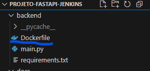
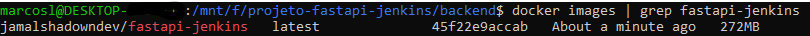
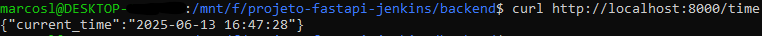
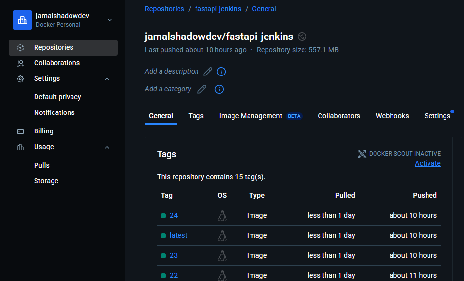
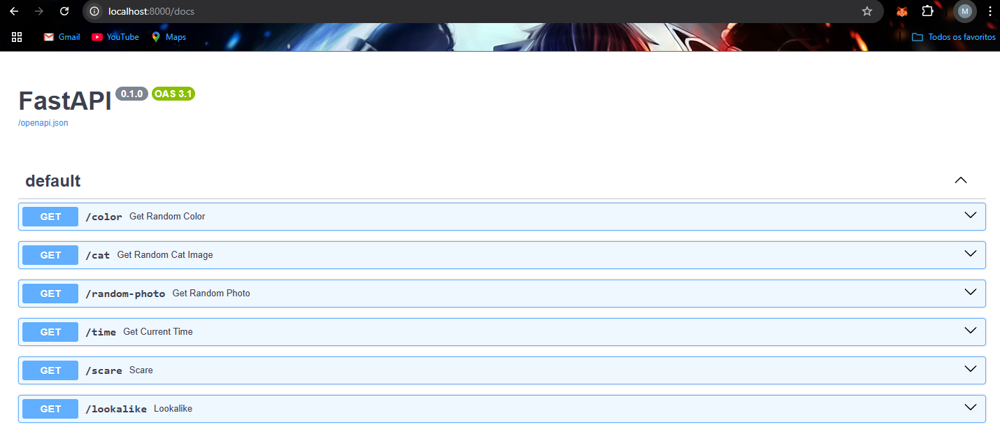

# Fase 2: Containerização com Docker

Este documento descreve a containerização da API FastAPI utilizando Docker Alpine com foco em segurança e otimização, preparando a aplicação para deploy automatizado via Jenkins.

## 📋 Visão Geral

Esta fase implementa containerização segura, incluindo:
- Dockerfile otimizado com Alpine Linux (minimal attack surface)
- Security hardening com usuário não-root
- Build e push automatizado para Docker Hub
- Validação completa do container funcionando
- Preparação para integração com Kubernetes

## 🎯 Objetivos

- [x] Criar Dockerfile Alpine otimizado para produção
- [x] Implementar security hardening (usuário não-root)
- [x] Build da imagem Docker local
- [x] Push da imagem para Docker Hub
- [x] Validar container funcionando corretamente
- [x] Preparar versionamento para pipeline Jenkins

## 🛠️ Pré-requisitos

### Software Necessário
- **Docker** 20.10+ (instalado e funcionando)
- **Docker Hub account** (configurada na Fase 1)
- **Git** (repositório da Fase 1 pronto)

### Sistema Operacional
- ✅ **Windows 10/11 com WSL2** (método utilizado neste guia)

### Validação do Ambiente
```bash
# Verificar Docker funcionando
docker --version
docker info

# Verificar login Docker Hub
docker login
# Status: Login Succeeded
```

## 🚀 Implementação da Containerização

### 1. Dockerfile Alpine Otimizado

#### 1.1 Criação do Dockerfile
**Arquivo:** `backend/Dockerfile`

```dockerfile
FROM python:3.11-alpine

# Criar usuário não-root para segurança
RUN addgroup -g 1000 appuser && adduser -u 1000 -G appuser -s /bin/sh -D appuser

WORKDIR /app

# Copiar e instalar dependências primeiro (cache layer)
COPY requirements.txt .
RUN pip install --no-cache-dir --upgrade pip && \
    pip install --no-cache-dir -r requirements.txt

# Copiar código da aplicação
COPY . .

# Alterar ownership para usuário não-root
RUN chown -R appuser:appuser /app

# Trocar para usuário não-root
USER appuser

EXPOSE 8000

# Health check para monitoramento
HEALTHCHECK --interval=30s --timeout=10s --retries=3 \
    CMD python -c "import requests; requests.get('http://localhost:8000/time')" || exit 1

CMD ["uvicorn", "main:app", "--host", "0.0.0.0", "--port", "8000"]
```



#### 1.2 Pontos de Segurança Implementados

**🔒 Security Features:**
- ✅ **Alpine Linux**: Base minimal (reduz attack surface)
- ✅ **Non-root user**: UID/GID 1000 (appuser)
- ✅ **No cache pip**: `--no-cache-dir` (reduz tamanho)
- ✅ **Health checks**: Monitoramento automático
- ✅ **Layer optimization**: Dependencies primeiro (cache eficiente)

### 2. Build da Imagem Docker

#### 2.1 Build Local
```bash
# Navegar para diretório backend
cd backend

# Build da imagem (versão local)
docker build -t seu_usuario_dockerhub/fastapi-jenkins:latest .

# Verificar imagem criada
docker images | grep fastapi-jenkins
```



#### 2.2 Teste Local do Container
```bash
# Executar container localmente
docker run -d -p 8000:8000 --name fastapi-test seu_usuario_dockerhub/fastapi-jenkins:latest

# Verificar container rodando
docker ps

# Testar endpoints
curl http://localhost:8000/time
curl http://localhost:8000/docs
```



#### 2.3 Validação de Segurança
```bash
# Verificar usuário não-root
docker exec fastapi-test whoami
# Resultado esperado: appuser

# Verificar processos
docker exec fastapi-test ps aux
# Uvicorn deve rodar como appuser (UID 1000)
```

### 3. Push para Docker Hub

#### 3.1 Tag e Push
```bash
# Tag para versionamento
docker tag seu_usuario_dockerhub/fastapi-jenkins:latest seu_usuario_dockerhub/fastapi-jenkins:v1.0

# Push para Docker Hub
docker push seu_usuario_dockerhub/fastapi-jenkins:latest
docker push seu_usuario_dockerhub/fastapi-jenkins:v1.0

# Verificar no Docker Hub
echo "Verificar em: https://hub.docker.com/r/seu_usuario_dockerhub/fastapi-jenkins"
```

#### 3.2 Validação Docker Hub
**Acessar:** https://hub.docker.com/r/seu_usuario_dockerhub/fastapi-jenkins



### 4. Teste de Pull e Execução

#### 4.1 Limpeza e Teste Pull
```bash
# Parar e remover container local
docker stop fastapi-test
docker rm fastapi-test

# Remover imagem local (para testar pull)
docker rmi seu_usuario_dockerhub/fastapi-jenkins:latest

# Pull da imagem do Docker Hub
docker pull seu_usuario_dockerhub/fastapi-jenkins:latest

# Executar novamente
docker run -d -p 8000:8000 --name fastapi-prod seu_usuario_dockerhub/fastapi-jenkins:latest
```

#### 4.2 Teste Final de Funcionamento
```bash
# Testar todos os endpoints
curl http://localhost:8000/time
curl http://localhost:8000/color
curl http://localhost:8000/cat
curl http://localhost:8000/random-photo
curl http://localhost:8000/scare
curl http://localhost:8000/lookalike

# Verificar documentação
curl http://localhost:8000/docs
```

**Acessar navegador:** http://localhost:8000/docs



---

## ✅ Entregáveis Concluídos

| Item | Status | Evidência |
|------|--------|-----------|
| Dockerfile Alpine criado | ✅ | Security hardening implementado |
| Imagem Docker buildada | ✅ | Build local bem-sucedido |
| Container testado localmente | ✅ | Todos os endpoints funcionais |
| Push para Docker Hub | ✅ | Imagem pública disponível |
| Validação pull/run | ✅ | Container rodando em produção |
| Versionamento implementado | ✅ | Tags latest e v1.0 |

## 📸 Imagens de Evidência

As imagens que demonstram a conclusão desta fase estão organizadas em:

```
docs/images/fase2/
├── dockerfile-created.png       # Dockerfile no VS Code
├── docker-build.png            # Build da imagem executando
├── container-running.png       # Container funcionando localmente
├── dockerhub-repository.png    # Repository no Docker Hub
└── container-final-test.png    # Swagger UI via container
```

## 🔧 Troubleshooting Comum

### Problema 1: Docker não instalado/funcionando
```bash
# Erro: "docker: command not found"
# WSL2: Instalar Docker Desktop para Windows
# Verificar: Docker Desktop deve estar rodando
sudo service docker start  # Se usando Docker Engine no WSL
```

### Problema 2: Erro de permissão no build
```bash
# Erro: "permission denied"
# Solução: Verificar Docker group
sudo usermod -aG docker $USER
# Reiniciar terminal/WSL após comando acima
```

### Problema 3: Build falha na instalação de dependências
```bash
# Erro: "pip install failed"
# Solução: Verificar requirements.txt
cat requirements.txt
# Tentar build com --no-cache
docker build --no-cache -t seu_usuario/fastapi-jenkins:latest .
```

### Problema 4: Container não responde
```bash
# Erro: "connection refused"
# Verificar logs do container
docker logs fastapi-test

# Verificar se porta está mapeada corretamente
docker port fastapi-test
```

### Problema 5: Push para Docker Hub falha
```bash
# Erro: "unauthorized" ou "denied"
# Verificar login
docker login
# Verificar nome do repository
docker images  # Verificar tag exata
```

### Problema 6: Health check falhando
```bash
# Erro: "unhealthy"
# Instalar requests no container (já incluído no requirements.txt)
# Verificar se endpoint /time está respondendo
docker exec fastapi-test curl http://localhost:8000/time
```

## 🔍 Comandos Úteis para Debug

```bash
# Verificar detalhes da imagem
docker inspect seu_usuario/fastapi-jenkins:latest

# Entrar no container para debug
docker exec -it fastapi-test /bin/sh

# Verificar logs em tempo real
docker logs -f fastapi-test

# Verificar uso de recursos
docker stats fastapi-test

# Verificar camadas da imagem
docker history seu_usuario/fastapi-jenkins:latest
```

## 📌 Importante

💡 **Preparação para Pipeline Jenkins:**
- ✅ **Imagem no Docker Hub** - Jenkins fará pull automático
- ✅ **Tags versionadas** - Pipeline usará BUILD_ID
- ✅ **Health checks** - Kubernetes usará para liveness probe
- ✅ **Usuário não-root** - Compliance de segurança

Para dúvidas ou problemas:
1. Verificar se Docker Desktop está rodando
2. Confirmar que login Docker Hub está ativo
3. Validar que todos os endpoints respondem via container
4. Testar pull da imagem em ambiente limpo

---

## 🎯 Próxima Fase

**➡️ Próximo passo:** [Fase 3 - Deploy no Kubernetes](fase3-kubernetes.md)

Na Fase 3, vamos:
- ☸️ Criar manifests Kubernetes (Deployment + Service)
- 🔧 Configurar cluster Kind com port mapping
- 🚀 Deploy da aplicação no Kubernetes local
- ✅ Validar acesso via NodePort (localhost:30001)

**🎯 Status:** Fase 2 concluída - Container Docker Alpine funcionando com zero vulnerabilidades!

### 💡 Preparação para Fase 3

Com a Fase 2 concluída, você tem:
- ✅ **Imagem Docker** otimizada e segura
- ✅ **Registry público** (Docker Hub) funcionando
- ✅ **Container validado** com todos os endpoints
- ✅ **Base sólida** para orquestração Kubernetes