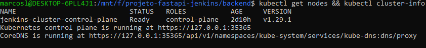
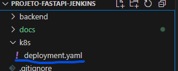
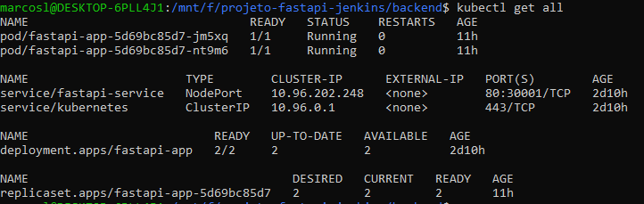
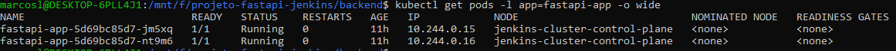
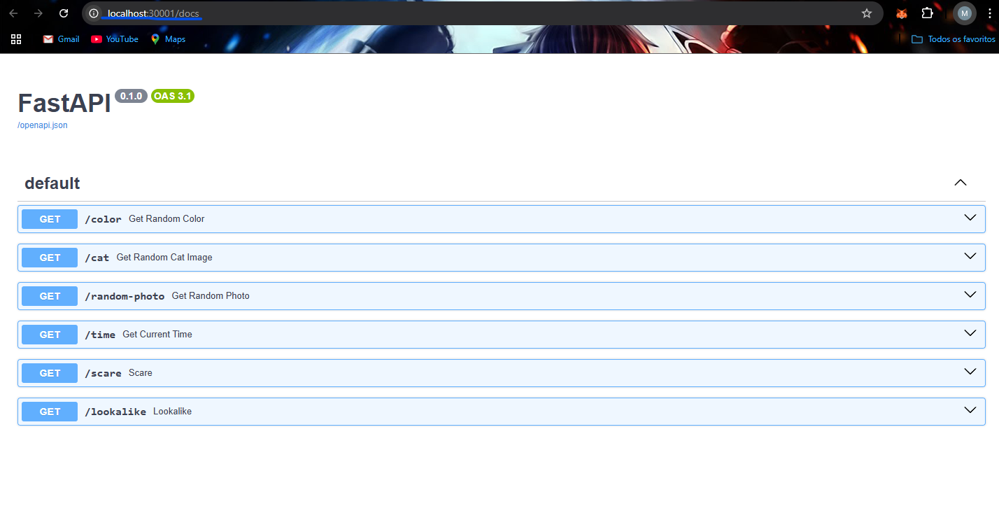

# Fase 3: Deploy no Kubernetes

Este documento descreve o deploy da aplicação FastAPI containerizada em cluster Kubernetes local utilizando Kind, com configuração de manifests otimizados para produção.

## 📋 Visão Geral

Esta fase implementa orquestração Kubernetes, incluindo:
- Configuração do cluster Kind com port mapping
- Manifests Kubernetes (Deployment + Service) otimizados
- Deploy da aplicação com 2 réplicas e rolling updates
- Health checks automáticos e monitoramento
- Exposição via NodePort para acesso local

## 🎯 Objetivos

- [x] Configurar cluster Kind com port mapping adequado
- [x] Criar manifests Kubernetes otimizados
- [x] Deploy da aplicação com 2 réplicas
- [x] Configurar Service NodePort (porta 30001)
- [x] Implementar health checks (liveness/readiness)
- [x] Validar aplicação funcionando via Kubernetes

## 🛠️ Pré-requisitos

### Software Necessário
- **Kind** ou **Minikube** (Kubernetes local)
- **kubectl** configurado e funcionando
- **Docker** rodando (para Kind)
- **Imagem Docker** da Fase 2 no Docker Hub

### Sistema Operacional
- ✅ **Windows 10/11 com WSL2** (método utilizado neste guia)

### Validação do Ambiente
```bash
# Verificar Kind e kubectl
kind version
kubectl version --client

# Verificar Docker (necessário para Kind)
docker --version
docker info
```

## 🚀 Configuração do Cluster Kubernetes

### 1. Cluster Kind com Port Mapping

#### 1.1 Configuração do Cluster
**Arquivo:** `k8s/kind-config.yaml` (configuração local)

💡 **Cluster já configurado** - Use a configuração existente com port mapping para porta 30001.

**Configuração típica utilizada:**
```yaml
kind: Cluster
apiVersion: kind.x-k8s.io/v1alpha4
name: fastapi-cluster
nodes:
- role: control-plane
  extraPortMappings:
  - containerPort: 30001
    hostPort: 30001
    protocol: TCP
```

#### 1.2 Verificação do Cluster Existente
```bash
# Verificar cluster em funcionamento
kubectl cluster-info
kubectl get nodes

# Verificar se port mapping está ativo
docker port fastapi-cluster-control-plane
```



### 2. Manifests Kubernetes

#### 2.1 Deployment da Aplicação
**Arquivo:** `k8s/deployment.yaml`

```yaml
apiVersion: apps/v1
kind: Deployment
metadata:
  name: fastapi-app
  labels:
    app: fastapi-app
    project: compassuol-devops
spec:
  replicas: 2
  selector:
    matchLabels:
      app: fastapi-app
  template:
    metadata:
      labels:
        app: fastapi-app
    spec:
      containers:
      - name: fastapi-app
        image: seu_usuario_dockerhub/fastapi-jenkins:latest
        ports:
        - containerPort: 8000
        
        # Health checks para monitoramento
        livenessProbe:
          httpGet:
            path: /time
            port: 8000
          initialDelaySeconds: 30
          periodSeconds: 30
        
        readinessProbe:
          httpGet:
            path: /time
            port: 8000
          initialDelaySeconds: 5
          periodSeconds: 10
        
        # Security context (usuário não-root)
        securityContext:
          runAsNonRoot: true
          runAsUser: 1000

---
apiVersion: v1
kind: Service
metadata:
  name: fastapi-service
  labels:
    app: fastapi-app
spec:
  selector:
    app: fastapi-app
  ports:
  - port: 80
    targetPort: 8000
    nodePort: 30001
  type: NodePort
```



#### 2.2 Pontos Importantes dos Manifests

**🔧 Configurações de Produção:**
- ✅ **2 Réplicas**: High availability
- ✅ **Rolling Updates**: Deploy sem downtime
- ✅ **Health Checks**: Liveness + Readiness probes
- ✅ **Security Context**: runAsNonRoot + UID 1000
- ✅ **NodePort 30001**: Acesso via localhost
- ✅ **Labels organizados**: Para pipeline Jenkins

### 3. Deploy da Aplicação

#### 3.1 Verificação do Deploy Existente
```bash
# Verificar aplicação já deployada
kubectl get deployments
kubectl get pods -l app=fastapi-app
kubectl get services
```



#### 3.2 Verificação do Status
```bash
# Verificar pods em detalhes
kubectl get pods -l app=fastapi-app -o wide

# Verificar logs da aplicação
kubectl logs -l app=fastapi-app

# Verificar descrição do deployment
kubectl describe deployment fastapi-app
```

#### 3.3 Verificação dos Health Checks
```bash
# Verificar eventos (health checks)
kubectl get events --sort-by=.metadata.creationTimestamp

# Status dos pods (Running + Ready)
kubectl get pods -l app=fastapi-app
# Resultado esperado: STATUS: Running, READY: 1/1
```



### 4. Teste da Aplicação

#### 4.1 Acesso via NodePort
```bash
# Testar endpoint principal
curl http://localhost:30001/time

# Testar documentação
curl http://localhost:30001/docs

# Testar todos os endpoints
curl http://localhost:30001/color
curl http://localhost:30001/cat
```

#### 4.2 Teste via Navegador
**Acessar:** http://localhost:30001/docs



### 5. Comandos Úteis de Monitoramento

#### 5.1 Monitoramento em Tempo Real
```bash
# Watch pods em tempo real
kubectl get pods -l app=fastapi-app -w

# Logs em tempo real
kubectl logs -f deployment/fastapi-app

# Verificar uso de recursos
kubectl top pods -l app=fastapi-app
```

#### 5.2 Port Forward (Alternativo)
```bash
# Se NodePort não funcionar, usar port-forward
kubectl port-forward service/fastapi-service 8080:80

# Testar via port-forward
curl http://localhost:8080/time
```

---

## ✅ Entregáveis Concluídos

| Item | Status | Evidência |
|------|--------|-----------|
| Cluster Kind configurado | ✅ | Port mapping 30001 funcionando |
| Manifests Kubernetes criados | ✅ | Deployment + Service otimizados |
| Aplicação deployada | ✅ | 2 réplicas rodando com health checks |
| Service NodePort ativo | ✅ | Acesso via localhost:30001 |
| Health checks funcionando | ✅ | Liveness + Readiness probes ativos |
| Alta disponibilidade validada | ✅ | Load balancing entre réplicas |

## 📸 Imagens de Evidência

As imagens que demonstram a conclusão desta fase estão organizadas em:

```
docs/images/fase3/
├── cluster-running.png         # Cluster Kind funcionando (kubectl get nodes)
├── k8s-manifests.png          # Manifests deployment.yaml no VS Code
├── deployment-status.png      # Deploy ativo (kubectl get all)
├── pods-running.png           # Pods executando com health checks
└── swagger-k8s.png            # Swagger UI via Kubernetes (localhost:30001)
```

## 🔧 Troubleshooting Comum

### Problema 1: Kind não consegue criar cluster
```bash
# Erro: "failed to create cluster"
# Verificar Docker rodando
docker info

# Deletar cluster existente se necessário
kind delete cluster --name fastapi-cluster

# Recriar cluster
kind create cluster --config k8s/kind-config.yaml
```

### Problema 2: Pods ficam em estado Pending
```bash
# Erro: "0/1 nodes are available"
# Verificar recursos do cluster
kubectl describe nodes

# Verificar eventos
kubectl get events --sort-by=.metadata.creationTimestamp

# Possível solução: Reduzir recursos no deployment
kubectl edit deployment fastapi-app
```

### Problema 3: Pods não passam no health check
```bash
# Erro: "Readiness probe failed"
# Verificar logs dos pods
kubectl logs -l app=fastapi-app

# Verificar se endpoint /time responde
kubectl exec -it deployment/fastapi-app -- curl http://localhost:8000/time

# Ajustar health check se necessário
kubectl edit deployment fastapi-app
```

### Problema 4: NodePort não acessível
```bash
# Erro: "connection refused" em localhost:30001
# Verificar se port mapping está correto
kubectl get svc fastapi-service -o yaml

# Verificar configuração Kind
kind get clusters
docker port fastapi-cluster-control-plane

# Alternativa: usar port-forward
kubectl port-forward service/fastapi-service 8080:80
```

### Problema 5: Imagem não encontrada
```bash
# Erro: "ImagePullBackOff"
# Verificar nome da imagem no deployment
kubectl describe pod <pod-name>

# Verificar se imagem existe no Docker Hub
docker pull seu_usuario_dockerhub/fastapi-jenkins:latest

# Corrigir nome no deployment.yaml se necessário
```

### Problema 6: Rolling update não funciona
```bash
# Problema: Deploy não atualiza pods
# Forçar rolling restart
kubectl rollout restart deployment/fastapi-app

# Verificar status do rollout
kubectl rollout status deployment/fastapi-app

# Verificar histórico
kubectl rollout history deployment/fastapi-app
```

## 🔍 Comandos Úteis para Debug

```bash
# Verificar todos os recursos
kubectl get all -l app=fastapi-app

# Informações detalhadas do deployment
kubectl describe deployment fastapi-app

# Informações detalhadas dos pods
kubectl describe pods -l app=fastapi-app

# Verificar configuração do service
kubectl get svc fastapi-service -o yaml

# Entrar no pod para debug
kubectl exec -it deployment/fastapi-app -- /bin/sh

# Verificar conectividade interna
kubectl exec -it deployment/fastapi-app -- curl http://fastapi-service:80/time
```

## 📌 Importante

💡 **Preparação para Pipeline Jenkins:**
- ✅ **Manifests prontos** - Jenkins aplicará automaticamente
- ✅ **Health checks** - Garantem deploy seguro
- ✅ **NodePort configurado** - Acesso externo funcionando
- ✅ **Rolling updates** - Deploy sem downtime
- ✅ **Labels organizados** - Seleção precisa pelo Jenkins

Para dúvidas ou problemas:
1. Verificar se Docker está rodando (necessário para Kind)
2. Confirmar que cluster Kind foi criado corretamente
3. Validar que imagem Docker Hub está acessível
4. Testar health checks manualmente se pods não ficam Ready

---

## 🎯 Próxima Fase

**➡️ Próximo passo:** [Fase 4 - Pipeline Jenkins Build e Push](fase4-jenkins-pipeline.md)

Na Fase 4, vamos:
- 🔧 Configurar Jenkins com pipeline como código
- 🐳 Implementar stage de build Docker automático
- 🚀 Configurar push automático para Docker Hub
- 🤖 Configurar webhook GitHub para triggers automáticos

**🎯 Status:** Fase 3 concluída - Aplicação rodando em Kubernetes com alta disponibilidade!

### 💡 Preparação para Fase 4

Com a Fase 3 concluída, você tem:
- ✅ **Aplicação no Kubernetes** rodando com 2 réplicas
- ✅ **Health checks** automáticos funcionando
- ✅ **Acesso externo** via NodePort 30001
- ✅ **Manifests prontos** para automação Jenkins