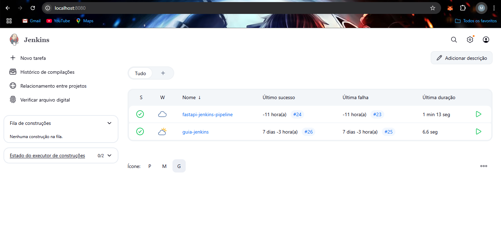
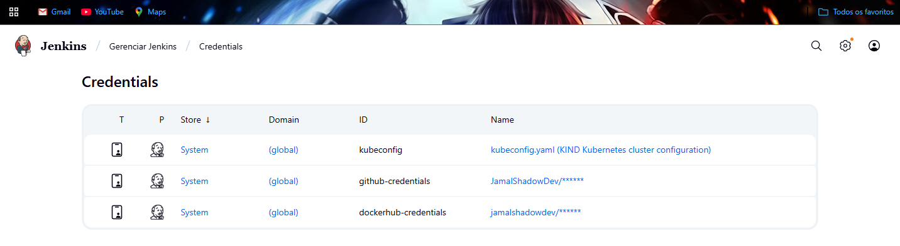
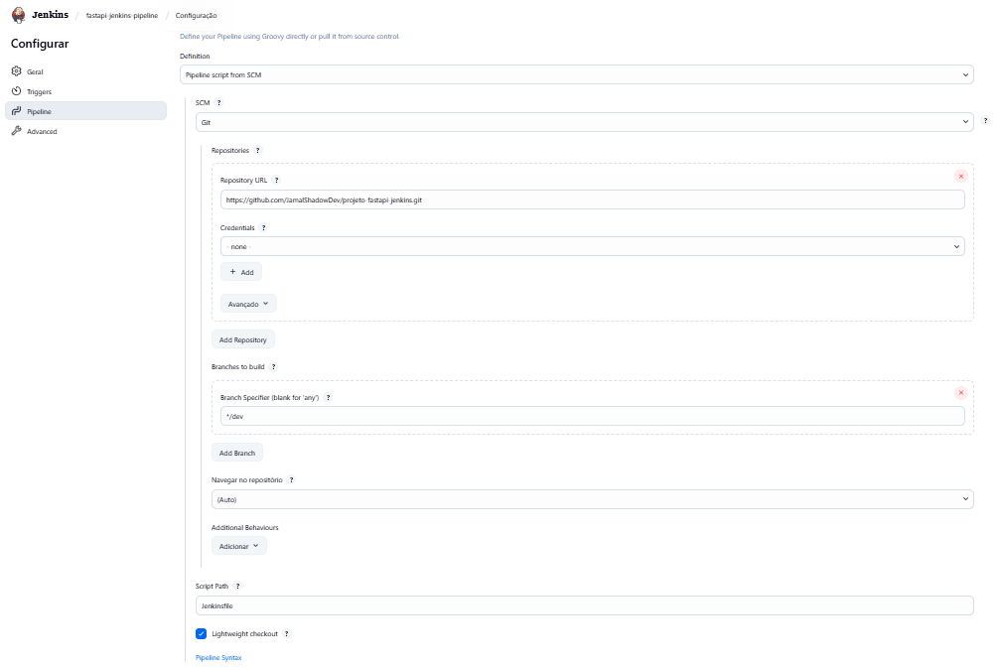
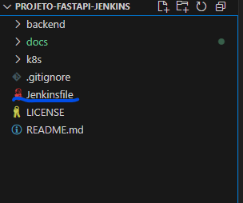
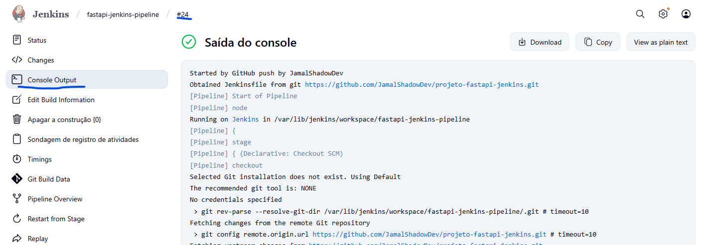
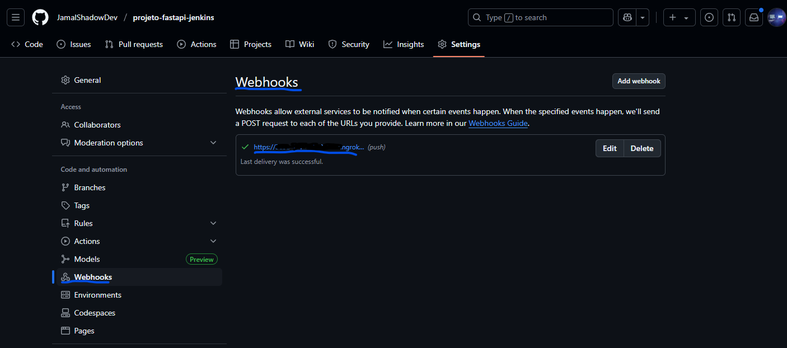

# Fase 4: Pipeline Jenkins Build e Push

Este documento descreve a implementação da pipeline Jenkins automatizada para build e push da aplicação FastAPI, configurando integração contínua com GitHub e Docker Hub.

## 📋 Visão Geral

Esta fase implementa automação CI/CD, incluindo:
- Configuração do Jenkins com pipeline como código
- Jenkinsfile com stages de build e push automatizados
- Integração com GitHub via webhooks
- Push automático para Docker Hub com versionamento
- Configuração de credenciais seguras no Jenkins

## 🎯 Objetivos

- [x] Configurar Jenkins local funcionando
- [x] Criar Jenkinsfile com pipeline estruturada
- [x] Implementar stage de build Docker automático
- [x] Configurar push automático para Docker Hub
- [x] Configurar credenciais Docker Hub no Jenkins
- [x] Implementar webhook GitHub para triggers automáticos

## 🛠️ Pré-requisitos

### Software Necessário
- **Jenkins** instalado e funcionando localmente
- **Docker** configurado no Jenkins agent
- **Git** configurado no Jenkins
- **ngrok** (para webhook GitHub)

### Sistema Operacional
- ✅ **Windows 10/11 com WSL2** (método utilizado neste guia)

### Validação do Ambiente
```bash
# Verificar Jenkins rodando
curl http://localhost:8080

# Verificar Docker disponível para Jenkins
docker --version
docker info
```

## 🚀 Configuração do Jenkins

### 1. Setup Inicial do Jenkins

#### 1.1 Verificação da Instalação
```bash
# Verificar Jenkins ativo
sudo systemctl status jenkins

# Acessar Jenkins
# Navegador: http://localhost:8080
```



#### 1.2 Plugins Necessários
**Instalar via Jenkins > Manage Jenkins > Plugins:**
- ✅ **Docker Pipeline Plugin**
- ✅ **GitHub Integration Plugin**  
- ✅ **Pipeline Plugin**
- ✅ **Credentials Plugin**

### 2. Configuração de Credenciais

#### 2.1 Credenciais Docker Hub
```
Jenkins > Manage Jenkins > Credentials > Global > Add Credentials

Tipo: Username with password
Username: seu_usuario_dockerhub
Password: sua_senha_dockerhub
ID: dockerhub-credentials
Description: Docker Hub Registry Access
```



#### 2.2 Verificação das Credenciais
```bash
# Testar localmente (referência)
docker login
# Login Succeeded
```

### 3. Criação da Pipeline

#### 3.1 Nova Pipeline Job
```
Jenkins Dashboard > New Item
Nome: fastapi-jenkins-pipeline
Tipo: Pipeline
```

#### 3.2 Configuração da Pipeline
```
Pipeline > Definition: Pipeline script from SCM
SCM: Git
Repository URL: https://github.com/SEU_USUARIO/projeto-fastapi-jenkins.git
Branch: */dev
Script Path: Jenkinsfile
```



### 4. Jenkinsfile - Pipeline como Código

#### 4.1 Arquivo Principal
**Arquivo:** `Jenkinsfile` (raiz do projeto)

```groovy
pipeline {
    agent any
    
    stages {
        stage('Checkout') {
            steps {
                echo '🔄 Fazendo checkout do código do Git'
                checkout scm
                
                // Debug: mostrar arquivos
                sh 'ls -la'
                sh 'ls -la backend/'
            }
        }
        
        stage('Build Docker Image') {
            steps {
                echo '🐳 Construindo imagem Docker'
                script {
                    dockerapp = docker.build("seu_usuario_dockerhub/fastapi-jenkins:${env.BUILD_ID}", "-f ./backend/Dockerfile ./backend")
                }
            }
        }
        
        stage('Push Docker Image') {
            steps {
                echo '🚀 Enviando imagem para Docker Hub'
                script {
                    docker.withRegistry('', 'dockerhub-credentials') {
                        dockerapp.push('latest')
                        dockerapp.push("${env.BUILD_ID}")
                    }
                }
            }
        }
    }
    
    post {
        always {
            echo '🏁 Pipeline finalizada'
        }
        
        success {
            echo '✅ Build realizado com sucesso!'
            echo "🐳 Imagem seu_usuario_dockerhub/fastapi-jenkins:${env.BUILD_ID} enviada para Docker Hub"
        }
        
        failure {
            echo '❌ Build falhou!'
            echo '🔍 Verificar logs para identificar o problema'
        }
    }
}
```



#### 4.2 Pontos Importantes do Jenkinsfile

**🔧 Features da Pipeline:**
- ✅ **3 Stages estruturados**: Checkout → Build → Push
- ✅ **Versionamento automático**: BUILD_ID para tags
- ✅ **Credenciais seguras**: dockerhub-credentials
- ✅ **Debug integrado**: Lista arquivos para troubleshooting
- ✅ **Post actions**: Success/failure handling
- ✅ **Docker multi-tag**: latest + BUILD_ID

### 5. Execução e Teste da Pipeline

#### 5.1 Primeiro Build Manual
```bash
# Via Jenkins Dashboard
# fastapi-jenkins-pipeline > Build Now
```

#### 5.2 Verificação dos Logs
```
Jenkins > fastapi-jenkins-pipeline > Build #1 > Console Output
```



#### 5.3 Verificação no Docker Hub
**Acessar:** https://hub.docker.com/r/seu_usuario_dockerhub/fastapi-jenkins

- ✅ **Tag latest** atualizada
- ✅ **Tag BUILD_ID** criada (ex: tag "1", "2", "3"...)

### 6. Configuração de Webhook GitHub

#### 6.1 Ngrok para Exposição Local
```bash
# Instalar ngrok (se necessário)
# Expor Jenkins para internet
ngrok http 8080

# Anotar URL gerada (ex: https://abc123.ngrok-free.app)
```

#### 6.2 Webhook no GitHub
```
GitHub Repository > Settings > Webhooks > Add webhook

Payload URL: https://SEU_NGROK_URL.ngrok-free.app/github-webhook/
Content type: application/json
Events: Just the push event
Active: ✅
```

#### 6.3 Configuração Jenkins para Webhook
```
Jenkins > fastapi-jenkins-pipeline > Configure
Build Triggers: ✅ GitHub hook trigger for GITScm polling
```



### 7. Teste de Automação Completa

#### 7.1 Trigger Automático
```bash
# Fazer mudança no código (qualquer arquivo)
echo "# Pipeline test" >> README.md

# Commit e push
git add .
git commit -m "test: trigger pipeline automática"
git push origin dev
```

#### 7.2 Verificação Automática
- ✅ **GitHub push** deve disparar **Jenkins build**
- ✅ **Pipeline executa** automaticamente
- ✅ **Nova imagem** é enviada para Docker Hub
- ✅ **Build ID incrementa** automaticamente

---

## ✅ Entregáveis Concluídos

| Item | Status | Evidência |
|------|--------|-----------|
| Jenkins configurado | ✅ | Dashboard funcionando + plugins |
| Credenciais Docker Hub | ✅ | dockerhub-credentials ativas |
| Pipeline job criada | ✅ | fastapi-jenkins-pipeline configurada |
| Jenkinsfile implementado | ✅ | 3 stages funcionando |
| Build automático funcionando | ✅ | Docker build via Jenkins |
| Push para Docker Hub ativo | ✅ | Versionamento com BUILD_ID |
| Webhook GitHub configurado | ✅ | Trigger automático funcionando |

## 📸 Imagens de Evidência

As imagens que demonstram a conclusão desta fase estão organizadas em:

```
docs/images/fase4/
├── jenkins-dashboard.png      # Dashboard Jenkins funcionando
├── docker-credentials.png     # Credenciais Docker Hub configuradas
├── pipeline-config.png        # Configuração da pipeline job
├── jenkinsfile-code.png       # Jenkinsfile no VS Code
├── pipeline-logs.png          # Console output build successful
└── webhook-config.png         # Webhook GitHub configurado
```

## 🔧 Troubleshooting Comum

### Problema 1: Jenkins não acessa Docker
```bash
# Erro: "docker: command not found"
# Adicionar jenkins ao grupo docker
sudo usermod -aG docker jenkins
sudo systemctl restart jenkins

# Verificar se funcionou
sudo -u jenkins docker ps
```

### Problema 2: Credenciais Docker Hub inválidas
```bash
# Erro: "unauthorized: authentication required"
# Verificar credenciais no Jenkins
# Jenkins > Credentials > dockerhub-credentials

# Testar localmente
docker login
docker push seu_usuario/fastapi-jenkins:test
```

### Problema 3: Dockerfile não encontrado
```bash
# Erro: "unable to prepare context"
# Verificar path no Jenkinsfile
# Correto: docker.build("nome:tag", "-f ./backend/Dockerfile ./backend")

# Verificar estrutura no Jenkins
sh 'ls -la backend/'
```

### Problema 4: Build falha na etapa de push
```bash
# Erro: "denied: requested access to the resource is denied"
# Verificar nome do repository
# Deve ser: seu_usuario_dockerhub/nome_repository

# Verificar se repository existe no Docker Hub
# Criar repository manualmente se necessário
```

### Problema 5: Webhook não funciona
```bash
# Erro: "unable to connect"
# Verificar ngrok rodando
ngrok http 8080

# Verificar URL no GitHub webhook
# Deve terminar com: /github-webhook/

# Testar webhook manualmente
curl -X POST https://SEU_NGROK_URL.ngrok-free.app/github-webhook/
```

### Problema 6: Pipeline não é acionada automaticamente
```bash
# Problema: Push não triggera build
# Verificar configuração no Jenkins job
# Build Triggers > GitHub hook trigger for GITScm polling

# Verificar webhook no GitHub
# Settings > Webhooks > Recent Deliveries (deve mostrar 200)
```

## 🔍 Comandos Úteis para Debug

```bash
# Verificar logs do Jenkins
sudo journalctl -u jenkins -f

# Verificar se Docker funciona para Jenkins
sudo -u jenkins docker --version
sudo -u jenkins docker images

# Testar build manual
docker build -t test:latest -f ./backend/Dockerfile ./backend

# Verificar webhooks GitHub
# GitHub > Settings > Webhooks > Recent Deliveries

# Verificar ngrok status
curl http://localhost:4040/api/tunnels
```

## 📌 Importante

💡 **Preparação para Fase 5 (Deploy):**
- ✅ **Pipeline funcionando** - Build e push automáticos
- ✅ **Versionamento ativo** - BUILD_ID incrementando
- ✅ **Docker Hub atualizado** - Imagens com tags corretas
- ✅ **Webhook funcionando** - Triggers automáticos
- ✅ **Base sólida** para adicionar stage de deploy Kubernetes

Para dúvidas ou problemas:
1. Verificar se Jenkins tem permissão para Docker
2. Confirmar que credenciais Docker Hub estão corretas
3. Validar que webhook GitHub está configurado adequadamente
4. Testar pipeline manualmente antes de automações

---

## 🎯 Próxima Fase

**➡️ Próximo passo:** [Fase 5 - Pipeline Jenkins Deploy](fase5-jenkins-deploy.md)

Na Fase 5, vamos:
- ☸️ Configurar Jenkins com acesso ao kubectl
- 🚀 Adicionar stage de deploy Kubernetes à pipeline
- 🔄 Implementar rolling updates automáticos
- ✅ Validar pipeline completa (Build → Push → Deploy)

**🎯 Status:** Fase 4 concluída - Pipeline CI automática funcionando!

### 💡 Preparação para Fase 5

Com a Fase 4 concluída, você tem:
- ✅ **Build automático** acionado por push GitHub
- ✅ **Push para Docker Hub** com versionamento
- ✅ **Pipeline estruturada** pronta para expansão
- ✅ **Webhook funcionando** para integração completa