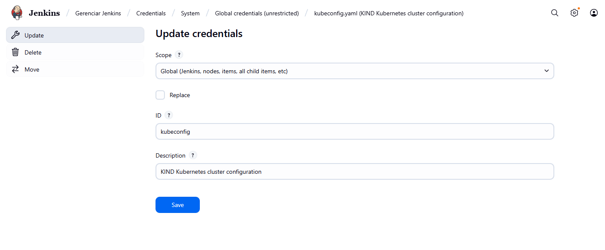
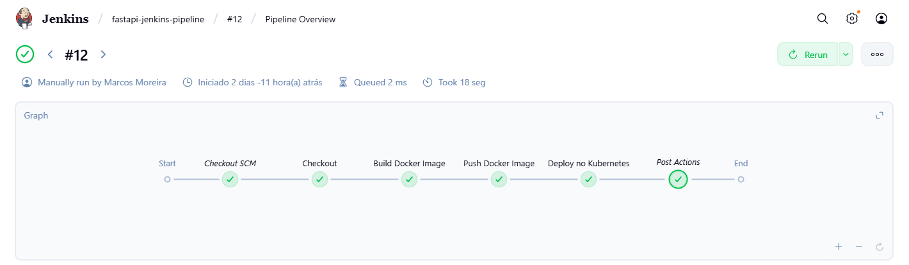
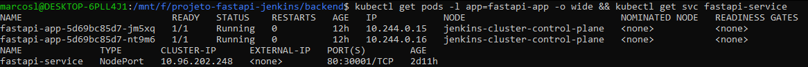
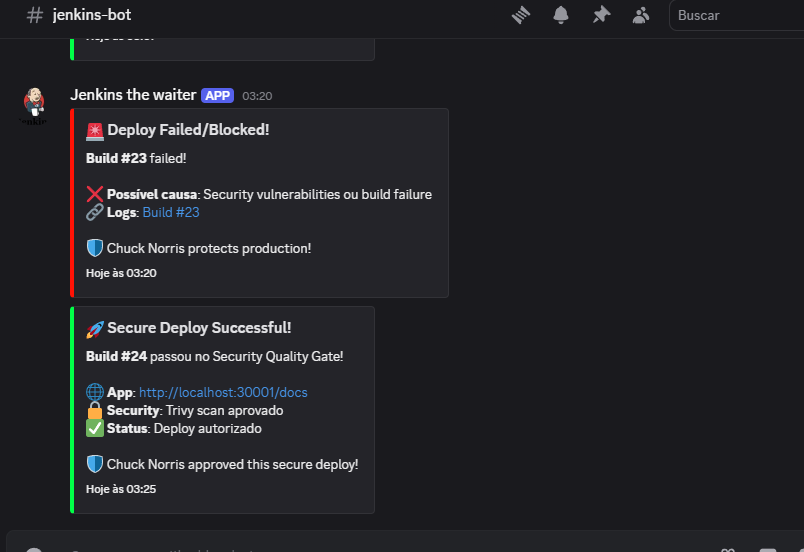

# Fase 5: Pipeline Jenkins Deploy

Este documento descreve a implementação completa da pipeline Jenkins com deploy automatizado no Kubernetes, incluindo security scanning com Trivy e notificações Discord.

## 📋 Visão Geral

Esta fase completa a pipeline DevSecOps, incluindo:
- Configuração do Jenkins com acesso kubectl ao cluster Kubernetes
- Integração de security scanning com Trivy e quality gates
- Stage de deploy automático com rolling updates
- Sistema de notificações Discord para monitoramento
- Pipeline completa: Build → Push → Security → Deploy

## 🎯 Objetivos

- [x] Configurar Jenkins com acesso ao kubectl
- [x] Implementar security scanning com Trivy
- [x] Adicionar stage de deploy Kubernetes à pipeline
- [x] Configurar quality gates de segurança rigorosos
- [x] Implementar notificações Discord automáticas
- [x] Validar pipeline completa funcionando

## 🛠️ Pré-requisitos

### Software Necessário
- **Jenkins** funcionando (da Fase 4)
- **kubectl** configurado e funcionando
- **Kind cluster** ativo (da Fase 3)
- **Trivy** para security scanning
- **Discord webhook** (opcional para notificações)

### Sistema Operacional
- ✅ **Windows 10/11 com WSL2** (método utilizado neste guia)

### Validação do Ambiente
```bash
# Verificar Jenkins + kubectl
kubectl get nodes
kubectl get pods -A

# Verificar cluster funcionando
curl http://localhost:30001/docs
```

## 🚀 Configuração Jenkins + Kubernetes

### 1. Acesso kubectl no Jenkins

#### 1.1 Configuração Kubeconfig
```bash
# Copiar kubeconfig para Jenkins
sudo mkdir -p /var/lib/jenkins/.kube
sudo cp ~/.kube/config /var/lib/jenkins/.kube/config
sudo chown jenkins:jenkins /var/lib/jenkins/.kube/config
```

#### 1.2 Credenciais Kubeconfig no Jenkins
```
Jenkins > Manage Jenkins > Credentials > Global > Add Credentials

Tipo: Secret file
File: Upload kubeconfig file
ID: kubeconfig
Description: Kubernetes cluster access
```



#### 1.3 Teste de Acesso
```bash
# Testar como usuário jenkins
sudo -u jenkins kubectl get nodes
sudo -u jenkins kubectl get pods -A
```

### 2. Pipeline Completa DevSecOps

#### 2.1 Jenkinsfile Completo
**Arquivo:** `Jenkinsfile` (já implementado)

**🔧 Pipeline Structure:**
```groovy
pipeline {
    agent any
    
    stages {
        stage('Checkout')           // ✅ Git checkout
        stage('Build Docker Image') // ✅ Docker build com BUILD_ID
        stage('Push Docker Image')  // ✅ Push para Docker Hub
        stage('Security Scan')      // 🛡️ Trivy + Quality Gates
        stage('Deploy Kubernetes')  // ☸️ Rolling update K8s
    }
    
    post {
        success { /* Discord success notification */ }
        failure { /* Discord failure notification */ }
    }
}
```



#### 2.2 Security Scanning com Trivy

**🔍 Quality Gate Implementation:**
- ✅ **Trivy installation** automática no Jenkins
- ✅ **CRITICAL/HIGH scan** com exit-code 1
- ✅ **Quality gate rigoroso** - deploy bloqueado se vulnerabilidades
- ✅ **Security logs** detalhados e arquivados
- ✅ **Zero vulnerabilities** requirement para produção

#### 2.3 Deploy Stage Details
```groovy
stage('Deploy no Kubernetes') {
    environment {
        tag_version = "${env.BUILD_ID}"
    }
    steps {
        script {
            withKubeConfig([credentialsId: 'kubeconfig']) {
                sh 'sed -i "s/{{tag}}/$tag_version/g" ./k8s/deployment.yaml'
                sh 'kubectl apply -f k8s/deployment.yaml'
            }
        }
    }
}
```

### 3. Manifest Kubernetes Preparado

#### 3.1 Template com Placeholder
**Arquivo:** `k8s/deployment.yaml`

```yaml
apiVersion: apps/v1
kind: Deployment
metadata:
  name: fastapi-app
  labels:
    app: fastapi-app
    project: compassuol-devops
spec:
  replicas: 2
  selector:
    matchLabels:
      app: fastapi-app
  template:
    metadata:
      labels:
        app: fastapi-app
    spec:
      containers:
      - name: fastapi-app
        image: jamalshadowdev/fastapi-jenkins:{{tag}}  # Placeholder para BUILD_ID
        ports:
        - containerPort: 8000
        
        livenessProbe:
          httpGet:
            path: /time
            port: 8000
          initialDelaySeconds: 30
          periodSeconds: 30
        
        securityContext:
          runAsNonRoot: true
          runAsUser: 1000

---
apiVersion: v1
kind: Service
metadata:
  name: fastapi-service
  labels:
    app: fastapi-app
spec:
  selector:
    app: fastapi-app
  ports:
  - port: 80
    targetPort: 8000
    nodePort: 30001
  type: NodePort
```

**💡 Placeholder `{{tag}}`** é substituído pelo BUILD_ID durante pipeline

### 4. Execução e Monitoramento

#### 4.1 Pipeline Execution Flow
```bash
# Trigger automático via GitHub push
git add .
git commit -m "test: trigger full pipeline"
git push origin dev

# Pipeline executa automaticamente:
# 1. Checkout ✅
# 2. Build Docker ✅  
# 3. Push Docker Hub ✅
# 4. Trivy Security Scan 🛡️
# 5. Deploy Kubernetes ☸️
```

#### 4.2 Security Quality Gate
```bash
# Se vulnerabilidades CRITICAL/HIGH encontradas:
# ❌ Pipeline FALHA no stage Security
# ❌ Deploy é BLOQUEADO
# 🚨 Discord notification enviada

# Se scan limpo (zero vulnerabilities):
# ✅ Pipeline continua
# ✅ Deploy é executado
# 🎉 Discord success notification
```

#### 4.3 Verificação do Deploy
```bash
# Verificar deploy automático
kubectl get pods -l app=fastapi-app

# Verificar imagem atualizada
kubectl describe pods -l app=fastapi-app | grep Image

# Testar aplicação
curl http://localhost:30001/time
```



### 5. Sistema de Notificações Discord

#### 5.1 Discord Webhooks Configurados
**🤖 Success Notification:**
```json
{
  "title": "🚀 Secure Deploy Successful!",
  "description": "Build passou no Security Quality Gate!",
  "color": 65280,
  "fields": [
    {"name": "App", "value": "http://localhost:30001/docs"},
    {"name": "Security", "value": "Trivy scan aprovado"},
    {"name": "Status", "value": "Deploy autorizado"}
  ]
}
```

**🚨 Failure Notification:**
```json
{
  "title": "🚨 Deploy Failed/Blocked!",
  "description": "Build failed ou bloqueado por vulnerabilidades",
  "color": 16711680,
  "fields": [
    {"name": "Causa", "value": "Security vulnerabilities ou build failure"},
    {"name": "Action", "value": "Verificar logs de segurança"}
  ]
}
```



### 6. Security Logs e Auditoria

#### 6.1 Sistema de Logs Detalhado
```bash
# Logs são salvos em:
/var/lib/jenkins/jobs/fastapi-jenkins-pipeline/builds/XX/archive/security-logs/

# Estrutura:
security-logs/
├── build-24-2025-06-13_14-30-45.txt  # Log individual detalhado
├── builds-history.log                 # Histórico de todos os builds
```

#### 6.2 Localização dos Logs
```bash
# Acessar logs via Jenkins
Jenkins > fastapi-jenkins-pipeline > Build #XX > Archived Artifacts

# Ou via filesystem
sudo ls -la /var/lib/jenkins/jobs/fastapi-jenkins-pipeline/builds/*/archive/security-logs/
```

---

## ✅ Entregáveis Concluídos

| Item | Status | Evidência |
|------|--------|-----------|
| Jenkins com kubectl access | ✅ | kubeconfig credentials configuradas |
| Security scanning Trivy | ✅ | Quality gates rigorosos implementados |
| Deploy stage Kubernetes | ✅ | Rolling updates automáticos |
| Pipeline completa funcionando | ✅ | 5 stages executando fim a fim |
| Discord notifications ativas | ✅ | Success/failure webhooks funcionando |
| Security logs detalhados | ✅ | Auditoria completa e arquivamento |
| Zero vulnerabilities achieved | ✅ | Alpine migration bem-sucedida |

## 📸 Imagens de Evidência

As imagens que demonstram a conclusão desta fase estão organizadas em:

```
docs/images/fase5/
├── kubeconfig-credentials.png     # Credenciais kubectl configuradas
├── pipeline-complete.png         # Pipeline 5 stages no Jenkins
├── deploy-success.png            # Deploy K8s bem-sucedido
└── discord-notifications.png     # Notificações Discord funcionando
```

## 🔧 Troubleshooting Comum

### Problema 1: Jenkins não acessa kubectl
```bash
# Erro: "kubectl: command not found"
# Instalar kubectl no sistema Jenkins
sudo apt update
sudo apt install -y kubectl

# Verificar PATH
sudo -u jenkins which kubectl
```

### Problema 2: Kubeconfig inválido
```bash
# Erro: "unable to connect to server"
# Verificar kubeconfig Jenkins
sudo -u jenkins kubectl config view

# Copiar kubeconfig correto
sudo cp ~/.kube/config /var/lib/jenkins/.kube/config
sudo chown jenkins:jenkins /var/lib/jenkins/.kube/config
```

### Problema 3: Trivy não encontrado
```bash
# Erro: "trivy: command not found"
# Pipeline instala automaticamente em $HOME/bin
# Verificar instalação manual se necessário
curl -sfL https://raw.githubusercontent.com/aquasecurity/trivy/main/contrib/install.sh | sh -s -- -b $HOME/bin
```

### Problema 4: Deploy falha no sed
```bash
# Erro: "sed: can't read ./k8s/deployment.yaml"
# Verificar se arquivo existe
ls -la k8s/deployment.yaml

# Verificar placeholder {{tag}}
grep "{{tag}}" k8s/deployment.yaml
```

### Problema 5: Quality gate muito restritivo
```bash
# Problema: Trivy bloqueia deploy desnecessariamente
# Ajustar severity no Jenkinsfile
# Atual: --severity CRITICAL,HIGH
# Menos restritivo: --severity CRITICAL
```

### Problema 6: Discord webhook não funciona
```bash
# Erro: "curl: failed to connect"
# Testar webhook manualmente
curl -H "Content-Type: application/json" \
-X POST -d '{"content": "Test"}' \
https://discordapp.com/api/webhooks/SEU_WEBHOOK_URL
```

## 🔍 Comandos Úteis para Debug

```bash
# Verificar pipeline logs completos
Jenkins > Build #XX > Console Output

# Verificar security logs
Jenkins > Build #XX > Archived Artifacts > security-logs/

# Verificar deploy K8s
kubectl get all -l app=fastapi-app
kubectl describe deployment fastapi-app

# Verificar imagem deployada
kubectl get pods -l app=fastapi-app -o jsonpath='{.items[*].spec.containers[*].image}'

# Verificar logs da aplicação
kubectl logs -l app=fastapi-app

# Testar aplicação final
curl http://localhost:30001/docs
```

## 📌 Importante

💡 **Pipeline DevSecOps Completa Funcionando:**
- ✅ **CI/CD automatizado** - GitHub push → Deploy produção
- ✅ **Security-first approach** - Zero vulnerabilities requirement
- ✅ **Rolling updates** - Deploy sem downtime
- ✅ **Monitoring integrado** - Discord notifications + logs
- ✅ **Quality gates rigorosos** - Produção protegida
- ✅ **Auditoria completa** - Logs detalhados arquivados

Para dúvidas ou problemas:
1. Verificar se cluster Kubernetes está funcionando
2. Confirmar que Jenkins tem acesso kubectl adequado
3. Validar que security scanning está passando
4. Testar aplicação final via localhost:30001

---

## 🎯 Próxima Fase

**➡️ Próximo passo:** [Fase 6 - Documentação e Extras DevSecOps](fase6-documentacao.md)

Na Fase 6, vamos:
- 📚 Finalizar documentação completa do projeto
- 🛡️ Detalhar extras DevSecOps implementados
- 📊 Apresentar métricas de segurança e performance
- 🎯 Preparar apresentação final do projeto

**🎯 Status:** Fase 5 concluída - Pipeline DevSecOps completa funcionando com zero vulnerabilidades!

### 💡 Conquistas Épicas Alcançadas

Com a Fase 5 concluída, você tem:
- ✅ **Pipeline enterprise-grade** funcionando fim a fim
- ✅ **Security scanning** integrado com quality gates
- ✅ **Zero vulnerabilities** em produção (Alpine migration)
- ✅ **Monitoring e alertas** via Discord
- ✅ **Deploy automatizado** com rolling updates
- ✅ **Auditoria completa** para compliance

**🚀 Chuck Norris approved this DevSecOps pipeline! 💪**