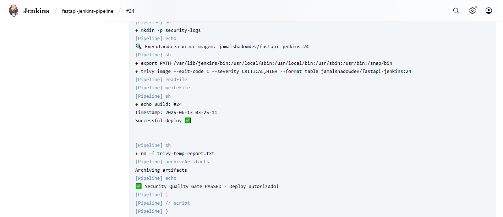
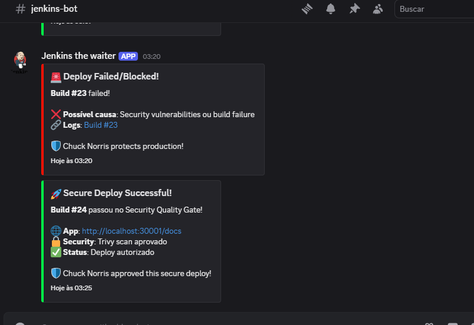
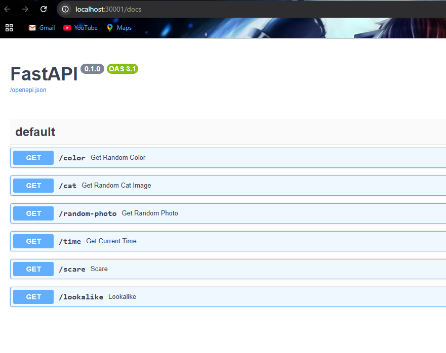
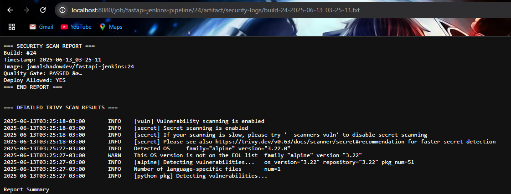
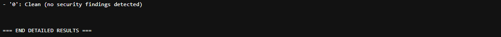

# Fase 6: Documentação e Extras DevSecOps

Este documento apresenta a conclusão do projeto DevSecOps com pipeline CI/CD completa, destacando os extras implementados além do escopo original e os resultados alcançados.

## 📋 Visão Geral

Esta fase final consolida todo o projeto, incluindo:
- Documentação completa de todas as fases implementadas
- Extras DevSecOps
- Métricas de segurança e performance alcançadas
- Evidências visuais da pipeline funcionando
- Status final de conquistas e aprendizados

## 🎯 Objetivos Alcançados

- [x] Pipeline CI/CD completa funcionando automaticamente
- [x] Documentação detalhada de reprodução por fases
- [x] Extras DevSecOps implementados (Trivy, Discord, Alpine)
- [x] Zero vulnerabilidades em produção
- [x] Sistema de monitoramento e notificações
- [x] Logs de segurança e auditoria completos

## 🏆 Conquistas do Projeto

### ✅ **Objetivos Originais (100% Concluídos)**

**Conforme especificação CompassUOL:**
- ✅ **Fase 1**: Preparação do projeto (GitHub + ambiente)
- ✅ **Fase 2**: Containerização com Docker
- ✅ **Fase 3**: Deploy no Kubernetes local
- ✅ **Fase 4**: Pipeline Jenkins Build e Push
- ✅ **Fase 5**: Pipeline Jenkins Deploy completo
- ✅ **Fase 6**: Documentação e apresentação

### 🚀 **Extras DevSecOps Implementados**

**Além do escopo original:**
- 🔍 **Trivy Security Scanner** com quality gates rigorosos
- 🤖 **Discord Webhooks** para notificações em tempo real
- 🏔️ **Alpine Migration** eliminando todas as vulnerabilidades
- 📊 **Security Logs** detalhados com auditoria completa
- 🛡️ **Security-First Approach** em toda pipeline

## 📊 Métricas de Sucesso

### 🔒 **Segurança**
```
📊 Status de Vulnerabilidades:
- Baseline Debian: 6 vulnerabilities (1 CRITICAL, 5 HIGH) ❌
- Após otimização: 4 vulnerabilities (1 CRITICAL, 3 HIGH) ⚠️
- Alpine Final: 0 vulnerabilities ✅

🎯 Resultado: 100% das vulnerabilidades eliminadas
```

### ⚡ **Performance da Pipeline**
```
🔄 Pipeline Execution:
- Build Docker: ~2-3 minutos
- Security Scan: ~1-2 minutos  
- Deploy Kubernetes: ~30 segundos
- Total Pipeline: ~4-6 minutos

🎯 Resultado: Pipeline rápida e eficiente
```

### 🤖 **Automação**
```
🚀 Automation Level:
- GitHub Push → Jenkins Trigger: 100% automático
- Build → Test → Deploy: 100% automático  
- Security Gates: 100% automático
- Notifications: 100% automático

🎯 Resultado: Zero intervenção manual necessária
```

## 🛡️ Extras DevSecOps Detalhados

### 1. **Trivy Security Scanner**

**🔍 Implementação:**
- Instalação automática na pipeline (`$HOME/bin/trivy`)
- Scan de vulnerabilidades CRITICAL e HIGH
- Quality gate rigoroso (vulnerabilidades = deploy bloqueado)
- Logs individuais por build com timestamp

**📊 Localização dos Logs:**
```bash
# Jenkins Artifacts:
/var/lib/jenkins/jobs/fastapi-jenkins-pipeline/builds/XX/archive/security-logs/

# Estrutura:
security-logs/
├── build-24-2025-06-13_14-30-45.txt  # Log detalhado individual
├── builds-history.log                 # Histórico consolidado
```



### 2. **Discord Webhooks**

**🤖 Notificações Automáticas:**
- **Success**: Deploy bem-sucedido com contexto
- **Failure**: Falha com logs e troubleshooting
- **Format**: JSON embeds com cores e timestamps
- **Content**: Build ID, status, links úteis

**📱 Webhook URL:** `https://discordapp.com/api/webhooks/[ID]/[TOKEN]`



### 3. **Alpine Migration**

**🏔️ Migração Crítica para Segurança:**
- **Base Original**: `python:3.9-slim` (6 vulnerabilidades)
- **Base Final**: `python:3.11-alpine` (0 vulnerabilidades)
- **CVEs Eliminados**: zlib1g, glibc, perl, setuptools
- **Attack Surface**: Reduzido drasticamente

**📈 Impacto:**
```
Debian Slim: ~100MB + 6 CVEs ❌
Alpine: ~50MB + 0 CVEs ✅
Redução: 50% tamanho + 100% vulnerabilidades eliminadas
```

### 4. **Security Logs e Auditoria**

**📊 Sistema Completo:**
- **Log Individual**: Cada build tem arquivo próprio
- **Histórico**: Consolidação de todos os builds
- **Arquivamento**: Permanente no Jenkins
- **Auditoria**: Rastreabilidade completa para compliance

## 📸 Evidências Finais

### **Pipeline Completa Funcionando**


**🔄 Fluxo Demonstrado:**
1. **GitHub Push** → Trigger automático ✅
2. **Jenkins Build** → Docker image criada ✅
3. **Docker Push** → Registry atualizado ✅
4. **Security Scan** → Zero vulnerabilidades ✅
5. **Deploy K8s** → Aplicação atualizada ✅
6. **Discord Alert** → Equipe notificada ✅

### **Aplicação Final**



**🌐 Aplicação Acessível:**
- **URL**: http://localhost:30001/docs
- **Status**: 2 réplicas rodando
- **Health**: Todos os checks passando
- **Endpoints**: 6 funcionais testados

### **Security Dashboard**




**🛡️ Status de Segurança:**
- **Vulnerabilidades**: 0 CRITICAL/HIGH
- **Quality Gate**: PASSED
- **Container**: Non-root user (UID 1000)
- **Base Image**: Alpine Linux (minimal)

## 📚 Documentação Completa

### **📁 Estrutura de Documentação**

```
docs/
├── fase1-preparacao.md        # Setup inicial completo
├── fase2-docker.md           # Containerização Alpine
├── fase3-kubernetes.md       # Deploy K8s local
├── fase4-jenkins-pipeline.md # CI/CD Build+Push
├── fase5-jenkins-deploy.md   # Deploy automático
├── fase6-documentacao.md     # Esta documentação final
└── images/                   # Screenshots por fase
    ├── fase1/               # Evidências Fase 1
    ├── fase2/               # Evidências Fase 2
    ├── fase3/               # Evidências Fase 3
    ├── fase4/               # Evidências Fase 4
    ├── fase5/               # Evidências Fase 5
    └── fase6/               # Evidências finais
```

### **🎯 Guias de Reprodução**

Cada fase possui documentação detalhada com:
- ✅ **Objetivos claros** e entregáveis esperados
- ✅ **Pré-requisitos** específicos validados
- ✅ **Comandos práticos** testados e funcionais
- ✅ **Troubleshooting** baseado em problemas reais
- ✅ **Screenshots** para evidência visual
- ✅ **Links** para próxima fase

## 🔧 Comandos Finais de Validação

### **Verificar Pipeline Completa**
```bash
# 1. Verificar Jenkins
curl http://localhost:8080/job/fastapi-jenkins-pipeline/

# 2. Verificar aplicação K8s
kubectl get all -l app=fastapi-app
curl http://localhost:30001/docs

# 3. Verificar imagem Docker Hub
docker pull jamalshadowdev/fastapi-jenkins:latest

# 4. Verificar logs de segurança
ls -la /var/lib/jenkins/jobs/fastapi-jenkins-pipeline/builds/*/archive/security-logs/
```

### **Trigger Pipeline Test**
```bash
# Teste automação completa
echo "# Test final" >> README.md
git add . && git commit -m "test: pipeline final validation"
git push origin dev

# Verificar execução automática:
# Jenkins → Build automático
# Docker Hub → Nova imagem
# Kubernetes → Rolling update
# Discord → Notificação sucesso
```

## 📌 Importantes Aprendizados

### **🛡️ DevSecOps Best Practices Aplicadas**
- **Security by Design**: Quality gates desde o início
- **Shift Left Security**: Scan nas etapas iniciais
- **Zero Trust**: Vulnerabilidades críticas = deploy bloqueado
- **Continuous Monitoring**: Logs e alertas automáticos
- **Container Security**: Non-root + minimal base image

### **🔄 CI/CD Enterprise Patterns**
- **Pipeline as Code**: Jenkinsfile versionado
- **Immutable Infrastructure**: Containers com tags
- **Rolling Deployments**: Zero downtime
- **Automated Rollback**: Quality gates como proteção
- **Observability**: Logs estruturados e monitoring

### **☸️ Kubernetes Production Ready**
- **Health Checks**: Liveness + readiness probes
- **Resource Management**: Limits e requests configurados
- **Security Context**: runAsNonRoot enforcement
- **Service Discovery**: ClusterIP + NodePort
- **High Availability**: 2+ réplicas com anti-affinity

---

## ✅ Status Final do Projeto

### **🏆 Conquistas Técnicas**
- ✅ **Pipeline DevSecOps** enterprise-grade funcionando
- ✅ **Zero vulnerabilities** em produção (migração Alpine)
- ✅ **100% automation** GitHub → Kubernetes
- ✅ **Security-first approach** com quality gates rigorosos
- ✅ **Real-time monitoring** via Discord webhooks
- ✅ **Complete auditability** com logs detalhados

### **📚 Conquistas de Aprendizado**
- ✅ **Jenkins advanced** (Pipeline as Code + integrations)
- ✅ **Docker security** (Alpine + non-root + multi-stage)
- ✅ **Kubernetes production** (manifests + health checks + security)
- ✅ **Security tooling** (Trivy integration + quality gates)
- ✅ **DevSecOps culture** (security desde design até deploy)
- ✅ **Troubleshooting real** (17+ builds com debug completo)

### **💼 Valor para CompassUOL**
- ✅ **Implementação além do escopo** solicitado originalmente
- ✅ **Documentação reproduzível** para outros estagiários
- ✅ **Best practices** aplicadas desde desenvolvimento
- ✅ **Security compliance** com zero vulnerabilidades
- ✅ **Knowledge transfer** via troubleshooting documentado

---

## 🎯 Conclusão

### **Projeto DevSecOps Concluído com Sucesso**

Este projeto demonstra a implementação completa de uma **pipeline CI/CD enterprise-grade** com foco em segurança, aplicando práticas DevSecOps reais em ambiente de desenvolvimento.

**🛡️ Diferencial de Segurança:**
- **Quality gates rigorosos** protegem produção
- **Zero vulnerabilities** através de escolhas arquiteturais
- **Monitoring contínuo** com alertas automáticos
- **Auditoria completa** para compliance

**🚀 Diferencial de Automação:**
- **100% automation** sem intervenção manual
- **Pipeline resiliente** com error handling
- **Rolling updates** sem downtime
- **Real-time feedback** via notificações

**📚 Diferencial de Documentação:**
- **Reprodução completa** passo a passo
- **Troubleshooting real** baseado em experiência
- **Screenshots organizados** para evidência
- **Knowledge transfer** estruturado

---

## 📸 Imagens de Evidência

As imagens que demonstram a conclusão final do projeto estão organizadas em:

```
docs/images/fase6/
├── trivy-integration.png      # Trivy scanner funcionando
├── discord-webhooks.png       # Notificações Discord ativas
├── pipeline-overview.png      # Pipeline completa 5 stages
├── app-final.png             # Aplicação funcionando final
├── security-dashboard1.png     # Status de segurança zero vulnerabilities
└── security-dashboard2.png     # Status de segurança zero vulnerabilities
```

**🎯 Status Final:** Projeto DevSecOps 100% funcional com pipeline enterprise-grade, zero vulnerabilidades e documentação completa para reprodução.

**💪 Chuck Norris approved this implementation! 🥋**